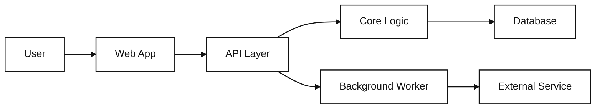

# codebase-map

Turn an unfamiliar repository into a compact agent context and a readable
visual learning map.

> Repository-grounded codebase indexing | connected architecture and user-flow
> views | black-and-white hand-drawn visual language | portable agent skill

## What this is

`codebase-map` is a reusable skill for agents that need to understand a
repository before changing it. It scans the codebase locally, records evidence
in a small structured index, and renders that index as connected visual views.

The index is the source of truth. The visual map is a human-friendly view of
the same graph, not a separate interpretation.

## Who it is for

Good fit for:

- developers onboarding to an unfamiliar codebase;
- visual learners who understand systems faster through connected diagrams;
- agents that need compact repository context before implementing changes;
- teams that want architecture and user-flow documentation grounded in source;
- codebases that need a repeatable map refreshed after changes.

Not a fit for:

- generating decorative product illustrations;
- replacing source code, tests, or formal API documentation;
- dumping the whole repository into an agent prompt;
- producing a static diagram disconnected from the underlying evidence;
- assuming one business domain or programming language.

## What it produces

For a target repository, the skill creates:

```text
reports/codebase-map/<repository-name>/
├── index.json        # machine-readable source of truth
├── context.md        # compact agent orientation
├── architecture.html # interactive human-facing map
└── evidence.md       # claims, sources, confidence, and gaps
```

The HTML view includes an architecture overview, the most useful end-to-end
user flow, grouped boundaries, progressive drill-down, cross-highlighting, and
plain-text evidence such as `path/to/file.ts:42 — symbolName()`.

The repository is scanned locally, but the agent receives compact context and
targeted source slices instead of the entire repository or entire index.

## Visual language

The visual style is inspired by simple hand-drawn explanation diagrams:

- white background;
- thin black lines and black text;
- generous whitespace;
- readable handwritten-style labels at normal weight;
- subtle sketch imperfections on borders and paths;
- crisp text, arrows, and connections;
- line weight, outlines, and patterns instead of bright colors;
- no character, decorative illustration, gradient, or dense legend;
- no giant dependency hairball in the default view.

The hand-drawn quality is restrained. It should feel human and approachable
without reducing diagram accuracy or readability.

## Example

A small generic architecture can be represented like this:



This Mermaid block is only a compact documentation example. The generated
`architecture.html` is driven by the indexed graph, so architecture, user-flow,
and evidence views reuse the same concept IDs and remain connected.

## Installation

Copy the skill bundle into the skills directory supported by your agent:

```text
<agent-skills-directory>/codebase-map/
├── SKILL.md
└── references/
    └── index-schema.md
```

Then invoke it using the convention supported by your agent:

```text
$codebase-map
```

Natural requests work too:

```text
Map this repository and show me the main user flow.
```

The skill is designed to work across Codex, Claude Code, and other agents that
support reusable repository skills. It does not require an MCP server, hosted
database, image-generation service, or parser package.

## Usage

Create a first map:

```text
Use $codebase-map to explain this repository visually.
Show the architecture, the main user-visible flow, important boundaries,
and the files I should read first.
```

Refresh an existing map:

```text
Use $codebase-map to refresh the repository map after the latest changes.
Highlight changed boundaries, stale relationships, and unresolved gaps.
```

Retrieve context for implementation:

```text
Use the codebase map to find the files and symbols involved in adding [change].
Explain the relevant flow before proposing an implementation.
```

## Workflow

The skill follows this sequence:

1. Read repository instructions, README files, manifests, and configuration.
2. Inventory relevant files with explicit exclusions for dependencies, caches,
   generated output, binaries, and secrets.
3. Identify entry points, routes, commands, workers, schemas, persistence,
   external services, tests, and deployment boundaries.
4. Extract lightweight file, symbol, import, route, schema, and test facts.
5. Trace the most central user-visible flow supported by evidence.
6. Store facts, relationships, confidence, and evidence in `index.json`.
7. Write compact `context.md` for fast agent orientation.
8. Render connected architecture and flow views in `architecture.html`.
9. Record unsupported or uncertain claims in `evidence.md`.

On refresh, the skill uses the current Git revision when available, updates
affected summaries and relationships, and removes stale claims instead of
silently preserving them.

## Design principles

- one shared graph drives every diagram and explanation;
- stable IDs keep repeated concepts connected across views and refreshes;
- evidence and confidence separate facts from architectural inference;
- progressive disclosure keeps large repositories readable;
- full local scanning does not mean full prompt injection;
- source files and existing documentation remain unchanged by default;
- outputs stay local and never expose secrets or environment values.

## Repository structure

```text
.
├── SKILL.md
├── README.md
├── LICENSE
├── references/
│   └── index-schema.md
└── examples/
    └── tiny-app/
        ├── README.md
        ├── handler.ts
        ├── repository.ts
        ├── database.ts
        └── worker.ts
```

The tiny fixture is intentionally domain-neutral. It exists to forward-test
indexing, evidence, stable IDs, and connected visual views.

## Notes

- Keep labels short; place explanations in the detail panel.
- Keep the default overview to roughly 10–15 important concepts.
- Use plain-text evidence paths instead of embedding source-code viewers.
- Do not add source-code download controls to the generated HTML.
- Add parser helpers or indexing services only when real repositories prove
  that lightweight extraction is insufficient.

## License

MIT. See [LICENSE](LICENSE).
