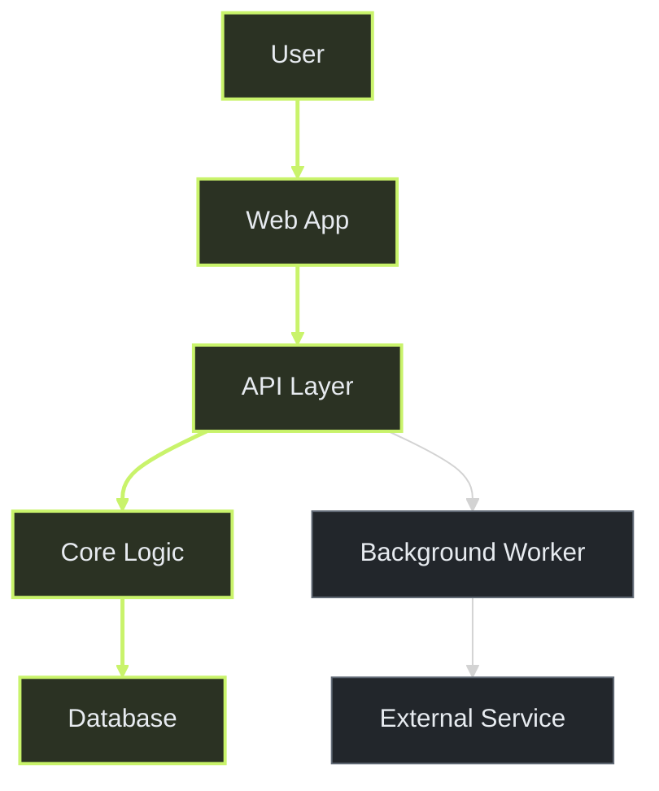

# codebase-map

Turn an unfamiliar repository into a compact agent context and a visual map
that answers questions about its structure, behavior, and data.

> Repository-grounded index | question-focused diagrams | interactive map |
> evidence attached to every path

## What this is

`codebase-map` is a user-invoked skill for people who want to understand a
repository visually. Invoke it with no question for a general overview, or name
a question such as a user journey, backend request, or database structure.
The skill traces the relevant source and answers with a diagram.

The index is the source of truth. Inline diagrams and the interactive HTML map
are views of the same evidence-backed graph.

## Who it is for

Good fit for:

- developers onboarding to an unfamiliar codebase;
- visual learners who understand systems faster through connected diagrams;
- people asking how a user journey, backend request, or database is organized;
- agents that need compact repository context before implementing changes;
- teams that want architecture and user-flow documentation grounded in source;
- codebases that need a repeatable map refreshed after changes.

Not a fit for:

- generating decorative product illustrations;
- replacing source code, tests, or formal API documentation;
- dumping the whole repository into an agent prompt;
- producing a static diagram disconnected from the underlying evidence;
- assuming one business domain or programming language.

## What it produces

For a target repository, the skill creates or refreshes:

```text
reports/codebase-map/<repository-name>/
├── index.json        # machine-readable source of truth
├── context.md        # compact agent orientation
├── architecture.html # interactive human-facing map
└── evidence.md       # claims, sources, confidence, and gaps
```

The HTML view keeps the general architecture overview and the latest
question-focused diagram. A new question replaces the previous focused view;
the overview remains. The skill returns the selected diagram inline with a
short caption.

User journeys and backend behavior use a journey, sequence, or data-flow view.
Database questions use an entity-relationship view grounded in schema and query
evidence, including keys and cardinality when the repository establishes them.
Selecting a concept in HTML reveals its source files, symbols, relationships,
and confidence.

The repository is scanned locally, but the agent receives compact context and
targeted source slices instead of the entire repository or entire index.

## Example

A question-focused view highlights the path that answers the user's question:



The highlighted route answers the focus question; nearby systems stay visible
as context.

The generated `architecture.html` uses the same indexed graph, so the
architecture overview, focused diagram, and evidence details stay connected.

## Installation

Copy the skill bundle into the skills directory supported by your agent:

```text
<agent-skills-directory>/codebase-map/
├── SKILL.md
└── references/
    └── index-schema.md
```

The user must invoke it by name using the convention supported by the agent:

```text
$codebase-map
```

After invocation, include a natural-language question in the same request:

```text
Use $codebase-map to show how a user request moves through the backend.
```

The skill is designed to work across Codex, Claude Code, and other agents that
support reusable repository skills. It does not require an MCP server, hosted
database, image-generation service, or parser package.

## Usage

Create a first map:

```text
Use $codebase-map to show how a user signs in.
Trace the user journey through the frontend, backend, and database. Return the
diagram inline and include the source paths in the interactive report.
```

Refresh an existing map:

```text
Use $codebase-map to refresh the repository map after the latest changes.
Highlight changed boundaries, stale relationships, and unresolved gaps.
```

Retrieve context for implementation:

```text
Use $codebase-map to find the files and symbols involved in adding [change].
Explain the relevant flow before proposing an implementation.
```

## Workflow

The skill follows this sequence:

1. Read repository instructions, README files, manifests, and configuration.
2. Inventory relevant files with explicit exclusions for dependencies, caches,
   generated output, binaries, and secrets.
3. Identify entry points, routes, commands, workers, schemas, persistence,
   external services, tests, and deployment boundaries.
4. Extract lightweight file, symbol, import, route, schema, and test facts.
5. If a question was supplied, select a diagram type and trace its relevant
   behavior or data. Otherwise choose the strongest user-visible flow.
6. Store facts, relationships, confidence, and evidence in `index.json`.
7. Write compact `context.md` for fast agent orientation.
8. Render the overview and latest focused view in `architecture.html`.
9. Return the matching diagram inline with a short caption and key sources.
10. Record unsupported or uncertain claims in `evidence.md`.

On refresh, the skill uses the current Git revision when available, updates
affected summaries and relationships, and removes stale claims instead of
silently preserving them.

## Design principles

- one shared graph drives every diagram and explanation;
- stable IDs keep repeated concepts connected across views and refreshes;
- the user's question chooses the focused diagram and its level of detail;
- evidence and confidence separate facts from architectural inference;
- progressive disclosure keeps large repositories readable;
- full local scanning does not mean full prompt injection;
- source files and existing documentation remain unchanged by default;
- outputs stay local and never expose secrets or environment values.

## Repository structure

```text
.
├── SKILL.md
├── README.md
├── LICENSE
├── references/
│   └── index-schema.md
└── examples/
    └── tiny-app/
        ├── README.md
        ├── handler.ts
        ├── repository.ts
        ├── database.ts
        └── worker.ts
```

The tiny fixture is intentionally domain-neutral. It exists to forward-test
indexing, evidence, stable IDs, and connected visual views.

## Notes

- Keep labels and captions short; place source paths in the detail panel.
- Keep the default overview to roughly 10–15 important concepts.
- Use plain-text evidence paths instead of embedding source-code viewers.
- Do not add source-code download controls to the generated HTML.
- Add parser helpers or indexing services only when real repositories prove
  that lightweight extraction is insufficient.

## License

MIT. See [LICENSE](LICENSE).
